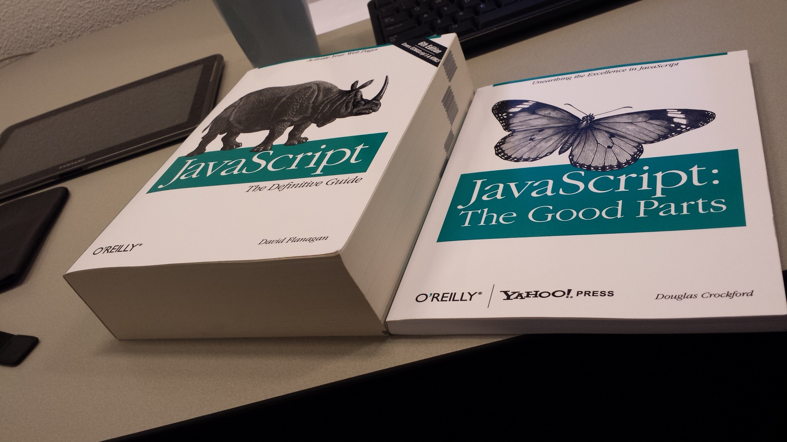

# First...

---



---

# History / Background

---

### Created in 1995 by Brendan Eich

---

### Is a scripting language, as the name would imply

---

### Can be used server-side (Node.js) and client-side

---

# Overview

---

## The rules are...

## there are no rules

---

### Dynamically typed

```js
var num = 100;

num = "iamastringnowbecausereasons";
```

---

### Everything is an object

```javascript
var obj = { hello: "world" };

obj.someProperty = true;

var arr = ["red", "green", "blue"];

arr.someProperty = true;

var fn = function() {
  return true;
};

fn.someProperty = true;
```

---

### Primitive types

- `Number`
- `String`
- `Boolean`
- `Object`
  - `Function`
  - `Array`
  - `Date`
  - `RegExp`
