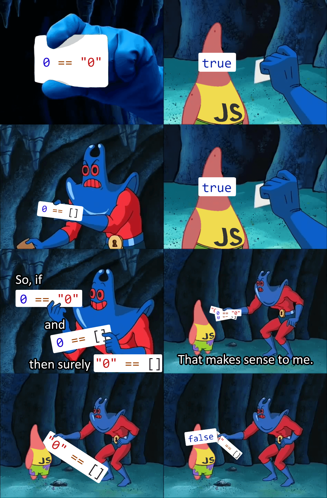

# JavaScript Basics

---

## Variable Declaration

```js
var message = "Hello World";

var greetFn = function() {
  return "Hello World";
};
```

Prefer `let` and `const`; we'll get to this in a bit!

---

## `this`

* Ties into prototypal nature of JavaScript
* _Certainly_ can be confusing

---

## Equality

_Can_ be one of the more confusing aspects of JavaScript. Type coersion often applies, i.e.

```js
const equal = 0 == "0"; // true
```

---

[](https://i.redd.it/4skcofasa1p01.png)

---

### Solution?

Use strict equality comparison (`===`) over abstract equality comparison (`==`)

```js
const equal = 0 === "0"; // false
```
